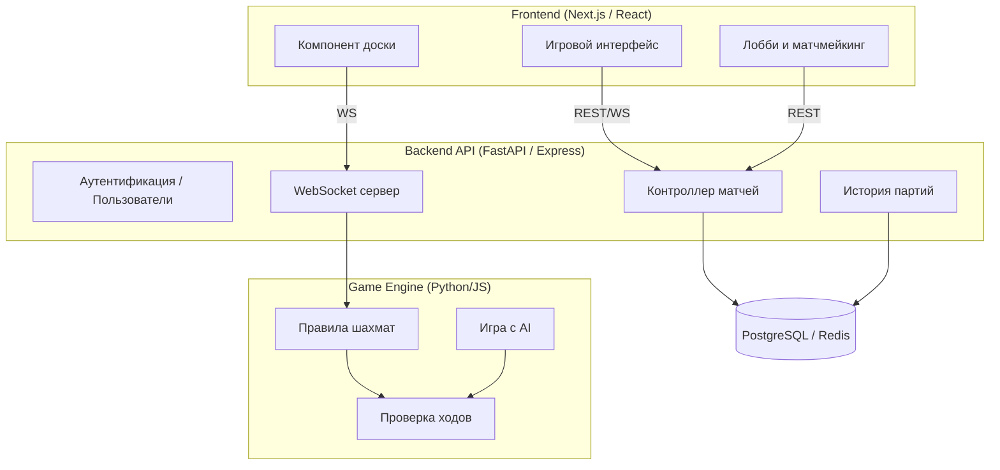
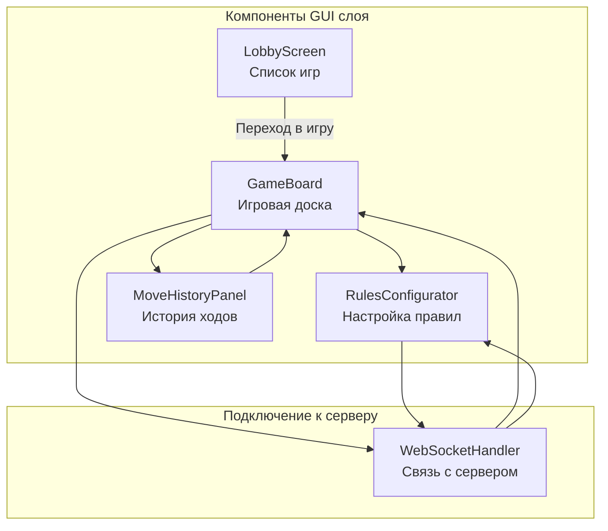

# Архитектура веб-приложения "Шахматы"

## Архитектурные принципы

### Основополагающие принципы (АРХИТЕКТУРНЫЙ МАНИФЕСТ)

- **Модульность**: Разделение на независимые фронтенд, бэкенд и движок игры
- **Универсальность интерфейса**: API-first подход, все действия доступны через REST/WebSocket
- **Реактивность**: WebSocket для синхронной игры и Live-коммуникации
- **Расширяемость**: Возможность добавления новых режимов (пешечные шахматы, головоломки и т.д.)

---

## Общая архитектура системы

Приложение построено по архитектуре **Client-Server** с реалтайм-обменом данными и движком игры, реализующим правила шахмат.

### Слои системы


## Архитектура коммуникации GUI


---

## Компоненты

### Frontend

- **Лобби**: список доступных игр, кнопка "Новая игра", список онлайн-игроков

- **Игровой интерфейс**: доска, чат, таймер, кнопка сдачи, переключатель режимов правил

- **Компоненты UI**: drag & drop фигур, отображение ходов, индикаторы последнего хода

- **Поддержка особых правил**: пользователь может выбрать нестандартные настройки, такие как DoubleKnight(конь ходит дважды за ход), XRay(слон может пробить сквозь одну фигуру),Blink(король может телепортироваться на любую свободную клекту) и т.д\


- **Игровой интерфейс**: доска, чат, таймер, кнопка сдачи, кнопка предложения ничьи

- **Компоненты UI**: drag & drop фигур, отображение ходов, индикаторы последнего хода

### Backend

- **REST API**:
  - `/auth` — регистрация/вход
  - `/matches` — создание, поиск и присоединение к партиям
  - `/history` — загрузка завершённых партий
- **WebSocket**:
  - `ws://.../match/:id` — обмен ходами в реальном времени

### Game Engine

- **Правила шахмат**:
  - Проверка валидности хода
  - Обработка рокировки, взятия на проходе, шаха и мата
  - Поддержка дополнительных правил (DoubleKnight,XRay,Blink и др.), включая модуль настройки параметров правил на старте игры и возможность включения и выключения одного или нескольких особых правил в течении игры
- **AI-модуль (опционально)**:
  - Алгоритм minimax с alpha-beta отсечением
  - Настраиваемая сложность (глубина)
  - Проверка валидности хода
  - Обработка рокировки, взятия на проходе, шаха и мата
- **AI-модуль (опционально)**:
  - Алгоритм minimax с alpha-beta отсечением
  - Настраиваемая сложность (глубина)

---

## Архитектура данных

### Структура состояния игры (пример)

```json
{
  "board": [["r", "n", "b", "q", "k", "b", "n", "r"], [...], ...],
  "turn": "white",
  "history": ["e2e4", "e7e5", "g1f3"],
  "castling": {"white": {"K": true, "Q": true}, "black": {"K": true, "Q": true}},
  "en_passant": "e3",
  "halfmove_clock": 0,
  "fullmove_number": 3
}
```

### Структура пользователей

```json
{
  "id": "user123",
  "username": "chessMaster",
  "rating": 1320,
  "games_played": 57,
  "wins": 29,
  "losses": 28
}
```

---

## Паттерны коммуникации

### REST для:

- Аутентификации
- Истории игр
- Управления лобби

### WebSocket для:

- Обмена ходами
- Таймеров
- Состояния подключений

**Пример протокола хода (WebSocket):**

```json
{
  "type": "move",
  "from": "e2",
  "to": "e4"
}
```

---

## Потоки операций

1. **Игрок заходит в лобби**
2. **Создает или присоединяется к игре**
3. **Открывается WebSocket-сессия**
4. **Игроки обмениваются ходами через WS**
5. **Валидация и обновление состояния на сервере**
6. **Сохранение истории хода**
7. **По завершении — запись результатов в БД**

---

## Безопасность и устойчивость

- JWT токены для доступа
- Rate limiting на REST и WS
- Redis pub/sub для масштабирования WS
- Проверка всех ходов на сервере (клиенту доверять нельзя)

---

## Преимущества архитектуры

1. **Гибкость**: можно подключать других клиентов (например, мобильное приложение)
2. **Расширяемость**: добавление головоломок, турниров, AI
3. **Надежность**: контроль ходов только на сервере
4. **Удобство масштабирования**: stateless REST и pub/sub WS
5. **Отказоустойчивость**: возможность переподключения к текущей партии

